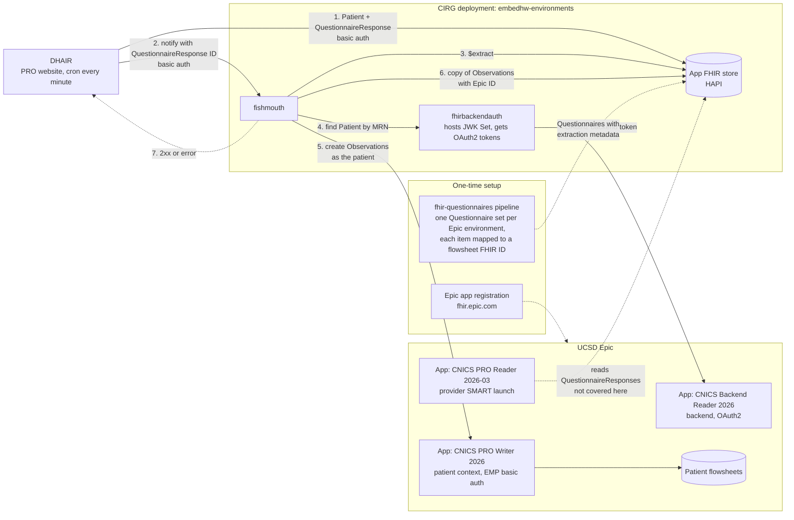
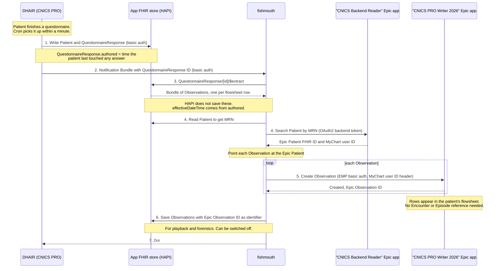
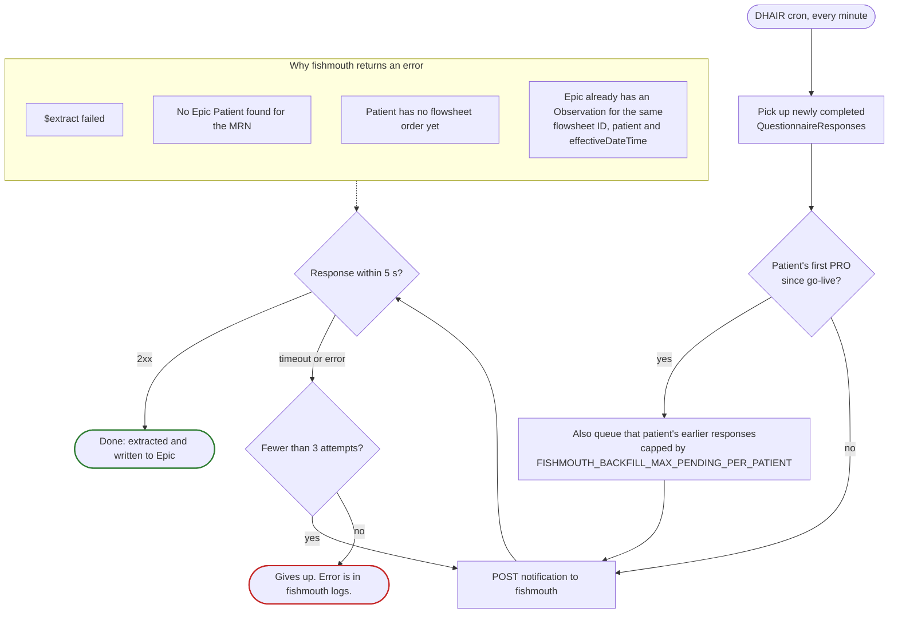

# Writing CNICS PRO QuestionnaireResponses to Epic flowsheets as Observations

How a questionnaire a patient completes in DHAIR ends up as flowsheet rows in
UCSD Epic. Diagrams are [Mermaid](https://mermaid.js.org/) and render on GitHub;
edit them in place or paste into <https://mermaid.live> to preview.

The step numbers (1 to 7) mean the same thing in the first two diagrams.

## Components

Solid arrows are the runtime write path. Dashed arrows are one-time setup or
flows outside this document.

## Write sequence

Happy path for one completed questionnaire. fishmouth handles the whole thing
inside the one request from DHAIR, so a 2xx in step 7 means both the extract
and the write to Epic succeeded.

## Failures and backfill

What DHAIR does around step 2, and where a write can fail.

Patients who never complete a PRO after go-live are not backfilled, at UCSD's
request.

## To confirm

Points the diagrams assume or leave open:

- **fhirbackendauth in step 4.** Drawn as the hop between fishmouth and Epic for
  the Patient search, inferred from `UPSTREAM_SEARCH_URL` in `fishmouth.env` and
  the JWK Set route in `base/docker-compose.yaml`.
- **Source of the MyChart user ID (WPR).** Drawn as coming back from the Patient
  search in step 4.
- **After the third failed attempt.** Drawn as a dead end; whether DHAIR picks
  the response up again on a later cron run is not shown.
- **Retry after a slow success.** If fishmouth takes longer than 5 s but the
  Epic write goes through, DHAIR's retry would hit Epic's duplicate rule (E4)
  and come back as an error.
- **Partial writes.** Whether some Observations from one response can land in
  Epic while others fail, and what step 7 returns then.
